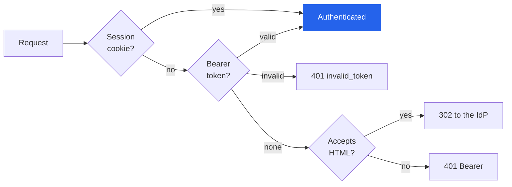
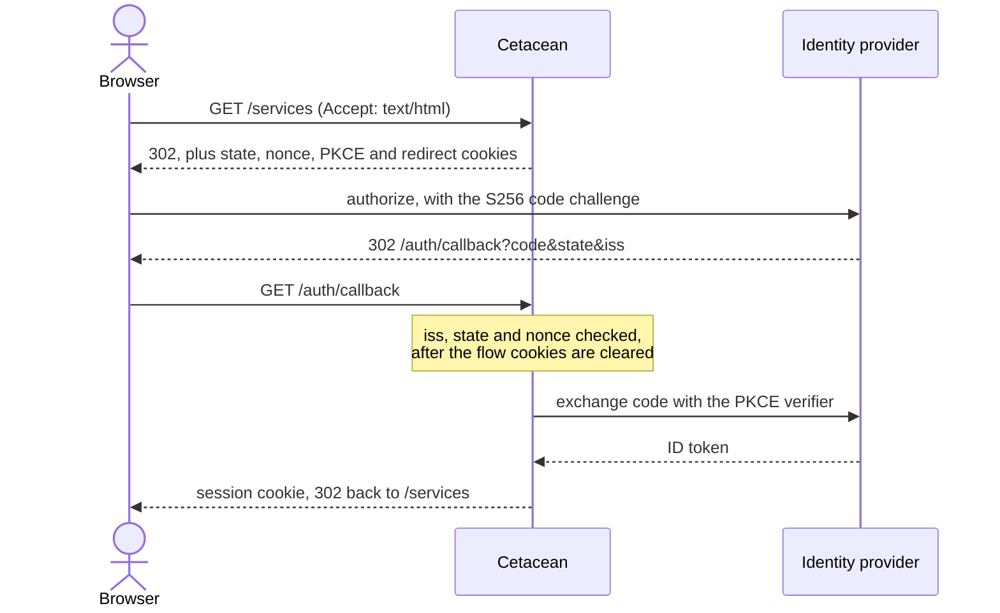

# Authentication

Cetacean authenticates requests with one of five providers, selected by [`auth.mode`][auth.mode]: `none`, `oidc`,
`tailscale`, `cert` or `headers`. One provider is active at a time. The default is `none`, which allows anonymous
access.

Authentication establishes identity only. To control which resources an identity may view or change, see
[Authorization][authorization].

## Quick start

Every setting below is available as an environment variable, a [config file][config-file] key, and most also as a
CLI flag. The examples show the environment of the Cetacean service in your `compose.yaml`; see
[Configuration][configuration] for the flags and the precedence rules. Secret settings accept a `_FILE` variant
that reads the value from a file at startup, which is how a Docker secret reaches the process.

```yaml tab="None"
# The default. Nothing to configure.
environment:
  CETACEAN_AUTH_MODE: none
```

```yaml tab="OIDC"
environment:
  CETACEAN_AUTH_MODE: oidc
  CETACEAN_AUTH_OIDC_ISSUER: https://idp.example.com
  CETACEAN_AUTH_OIDC_CLIENT_ID: cetacean
  CETACEAN_AUTH_OIDC_CLIENT_SECRET_FILE: /run/secrets/oidc_secret
  CETACEAN_AUTH_OIDC_REDIRECT_URL: https://cetacean.example.com/auth/callback
```

```yaml tab="Tailscale"
environment:
  CETACEAN_AUTH_MODE: tailscale
volumes:
  - /run/tailscale/tailscaled.sock:/run/tailscale/tailscaled.sock:ro
```

```yaml tab="mTLS"
environment:
  CETACEAN_AUTH_MODE: cert
  CETACEAN_AUTH_CERT_CA: /run/secrets/ca.pem
  CETACEAN_TLS_CERT: /run/secrets/server.pem
  CETACEAN_TLS_KEY: /run/secrets/server-key.pem
```

```yaml tab="Headers"
environment:
  CETACEAN_AUTH_MODE: headers
  CETACEAN_AUTH_HEADERS_SUBJECT: X-Remote-User
  CETACEAN_TRUSTED_PROXIES: "10.0.0.0/8"
```

## Identity

Every provider fills the same identity record. Read it with `GET /auth/whoami`. `subject` is the unique
identifier; `groups` feeds [authorization][authorization] audience matching.

| Field         | `none`      | `oidc`                             | `tailscale`             | `cert`                                | `headers`                      |
| ------------- | ----------- | ---------------------------------- | ----------------------- | ------------------------------------- | ------------------------------ |
| `subject`     | `anonymous` | `sub` claim                        | numeric user ID         | SPIFFE URI SAN, else CN, else email   | subject header                 |
| `displayName` | `Anonymous` | `name`, else `preferred_username`  | Tailscale display name  | CN, else the SPIFFE ID path           | name header, else subject      |
| `email`       |—          | `email` claim                      | Tailscale login name    | first email SAN                       | email header                   |
| `groups`      |—          | `groups` claim                     | app capability (below)  | Organizational Unit (OU) values       | groups header, comma-separated |

## Exempt paths

These paths skip authentication in every mode:

| Path                                              | Reason                                                   |
| ------------------------------------------------- | -------------------------------------------------------- |
| `/-/*`                                            | Health, readiness, metrics, SBOM and license endpoints   |
| `/api`, `/api/*`                                  | API documentation and the JSON-LD context                |
| `/assets/*`                                       | Dashboard static assets                                  |
| `/auth`, `/auth/*`                                | Login, callback, logout and `whoami`                     |
| `/mcp`                                            | The [MCP server][mcp] runs its own bearer-token check    |
| `/.well-known/*`                                  | OAuth discovery documents, unauthenticated by spec       |
| `/oauth/token`, `/oauth/revoke`, `/oauth/register` | Carry their own credentials in the request body          |

`/oauth/authorize` is not exempt: a user must authenticate before granting a client access. That is also why
the authorization server cannot run under the `none` mode — there would be no one to ask.

## Refused requests

A `401` must name a way to authenticate, in a `WWW-Authenticate` challenge
([RFC 9110 §15.5.2](https://www.rfc-editor.org/rfc/rfc9110#section-15.5.2)). Only OIDC has one to give: the
other modes read a credential HTTP cannot ask for — a certificate in the TLS layer, a header your proxy set,
the peer's place on your tailnet — so a refusal there is a `403`, and the [error code][api] says which.

| Mode                   | Refusal      | Challenge |
| ---------------------- | ------------ | --------- |
| `oidc`                 | `401 AUT001` | `Bearer`  |
| `cert`                 | `403 AUT005` | —         |
| `tailscale`, `headers` | `403 AUT006` | —         |

The reason is logged, not returned: which of "no subject header", "invalid proxy secret" or "not a trusted
proxy" applied describes your deployment to a caller that has not authenticated.

## None

Anonymous access. Every request receives a static identity with `subject: anonymous`.

This mode also bypasses [authorization][authorization]: a configured ACL policy has no effect while `auth.mode` is
`none`. Use it when Cetacean sits behind a VPN, a firewall, or a proxy that authenticates for you.

## OIDC

[OpenID Connect](https://openid.net/developers/how-connect-works/) with the authorization code flow for browsers
and ID token validation for scripts. Requires [`auth.oidc.issuer`][auth.oidc.issuer],
[`auth.oidc.client_id`][auth.oidc.client_id], [`auth.oidc.client_secret`][auth.oidc.client_secret] and
[`auth.oidc.redirect_url`][auth.oidc.redirect_url]; the redirect URL must use HTTPS unless it points at a loopback
address. See [OIDC configuration][oidc] for all parameters.

> [!NOTE]
> With [`server.public_url`][server.public_url] set, `auth.oidc.redirect_url` is derived as
> `{public_url}{base_path}/auth/callback` and only needs setting if your callback lives elsewhere.

A request is matched against each credential in turn, and only one that accepts HTML is ever redirected:



### Browser flow

Opening the dashboard unauthenticated sends you to your IdP to sign in, then back to the page you asked for.
`GET /auth/login` starts the same flow explicitly and honours a relative `?redirect=` path.



### Machine flow

Send an ID token as a Bearer token. It is verified against the IdP's JWKS endpoint on every request.

```http tab
GET /services HTTP/1.1
Authorization: Bearer eyJhbGci...
Accept: application/json
```

```bash tab
curl -H "Authorization: Bearer eyJhbGci..." \
     -H "Accept: application/json" \
     http://localhost:9000/services
```

### Sessions

Browser sessions require HTTPS, and expire with the ID token or after 8 hours, whichever comes first.

Restarting the server signs everyone out unless you set a fixed signing key. Set
[`auth.oidc.session_key`][auth.oidc.session_key] to a hex-encoded 32-byte value to keep sessions across restarts:

```bash
openssl rand -hex 32   # generate a 32-byte key
```

Pass it as a Docker secret rather than an inline value:

```yaml
environment:
  CETACEAN_AUTH_OIDC_SESSION_KEY_FILE: /run/secrets/session_key
secrets:
  - session_key
```

The cookie stores subject, display name, email and groups, but no raw token claims. Grants read from an OIDC claim
([`acl.oidc_claim`][acl.oidc_claim]) therefore reach Bearer-token requests only; for browser users, match on
`group:` audiences in the policy instead.

### Logout

`POST /auth/logout` clears the session cookie. If the IdP advertises an `end_session_endpoint`
([RFC 9722](https://www.rfc-editor.org/rfc/rfc9722)), the user is also redirected there for sign-out.

### IdP setup

**[Keycloak](https://www.keycloak.org/):**

1. Create a client with `confidential` access type
2. Set the valid redirect URI to `https://cetacean.example.com/auth/callback`
3. Enable "Standard Flow" (authorization code)
4. Take the client ID and secret from the Credentials tab

**[Auth0](https://auth0.com/):**

1. Create a "Regular Web Application"
2. Add `https://cetacean.example.com/auth/callback` to Allowed Callback URLs
3. Add `https://cetacean.example.com` to Allowed Logout URLs
4. Use the Auth0 domain as the issuer (for example `https://your-tenant.auth0.com`)

**[Dex](https://dexidp.io/):**

```yaml
staticClients:
  - id: cetacean
    secret: your-secret
    name: Cetacean
    redirectURIs:
      - https://cetacean.example.com/auth/callback
```

## Tailscale

Identifies users through the [Tailscale](https://tailscale.com/) WhoIs API. Requests from tailnet peers are
authenticated without a login flow. See [Tailscale configuration][tailscale] for all parameters.

### Choosing a mode

|                              | Local mode (default)                                                             | tsnet mode                                                                |
| ---------------------------- | -------------------------------------------------------------------------------- | ------------------------------------------------------------------------- |
| How it works                 | Queries the host's Tailscale daemon to identify peers                            | Embeds a Tailscale node inside the Cetacean process                       |
| Tailscale installed on host? | Yes, the daemon must be running                                                  | No                                                                        |
| Network binding              | Listens on [`server.listen_addr`][server.listen_addr]; only Tailscale addresses are authenticated      | Serves the app on port 443 of the tailnet node                            |
| Docker health checks         | Work normally, the health endpoint is auth-exempt                                | Work normally, `/-/health` and `/-/ready` stay on the regular listener    |
| Config complexity            | Minimal: `-auth-mode tailscale`                                                  | Needs an auth key, a hostname and a persistent state directory            |
| Best for                     | Hosts already running Tailscale (bare metal, VMs)                                | Containers, Swarm services, or hosts without Tailscale installed          |

> [!WARNING]
> In local mode Cetacean still listens on all interfaces by default. Requests from outside the tailnet are
> rejected, but the port is open to anything that can reach it. For real isolation, bind to the node's Tailscale
> address (`-listen 100.x.x.x:9000`) or use tsnet mode.

### Local mode

Uses the local Tailscale daemon to identify peers, so Cetacean must run on a node inside the tailnet with access to
`/run/tailscale/tailscaled.sock`.

```yaml
environment:
  CETACEAN_AUTH_MODE: tailscale
volumes:
  - /run/tailscale/tailscaled.sock:/run/tailscale/tailscaled.sock:ro
```

### tsnet mode

Embeds a Tailscale node in the Cetacean process. No local Tailscale installation is needed. The full app is served on
port 443 of the tailnet node; `/-/health` and `/-/ready` stay on `server.listen_addr` for Docker health checks.

```yaml
environment:
  CETACEAN_AUTH_MODE: tailscale
  CETACEAN_AUTH_TAILSCALE_MODE: tsnet
  CETACEAN_AUTH_TAILSCALE_AUTHKEY_FILE: /run/secrets/ts_authkey
  CETACEAN_AUTH_TAILSCALE_HOSTNAME: cetacean
  CETACEAN_AUTH_TAILSCALE_STATE_DIR: /var/lib/cetacean/tsnet
secrets:
  - ts_authkey
```

### Groups from capabilities

Set [`auth.tailscale.capability`][auth.tailscale.capability] to map Tailscale app capabilities to identity groups:

```yaml
environment:
  CETACEAN_AUTH_MODE: tailscale
  CETACEAN_AUTH_TAILSCALE_CAPABILITY: example.com/cap/cetacean
```

Then grant that capability in your Tailscale ACL policy:

```json
{
  "grants": [
    {
      "src": ["group:admins"],
      "dst": ["tag:cetacean"],
      "app": {
        "example.com/cap/cetacean": [
          {
            "groups": ["admin", "operators"]
          }
        ]
      }
    }
  ]
}
```

Groups from multiple matching grants are merged and deduplicated. Malformed capability values are skipped.

## Client certificates (mTLS)

Authenticates with [mTLS](https://en.wikipedia.org/wiki/Mutual_authentication#mTLS) client certificates. Standard
[X.509](https://www.rfc-editor.org/rfc/rfc5280) certificates and [SPIFFE](https://spiffe.io/) X.509-SVIDs both
work. See [client certificate configuration][client-certificates] for the CA setting.

```yaml
environment:
  CETACEAN_AUTH_MODE: cert
  CETACEAN_AUTH_CERT_CA: /run/secrets/ca.pem
  CETACEAN_TLS_CERT: /run/secrets/server.pem
  CETACEAN_TLS_KEY: /run/secrets/server-key.pem
secrets:
  - ca.pem
  - server.pem
  - server-key.pem
```

Clients without a certificate signed by that CA cannot connect. Identity comes from the SPIFFE URI SAN, else the
Common Name, else the first email SAN—a certificate carrying none of the three is rejected, as is one carrying
more than one SPIFFE SAN. Groups come from Organizational Unit (OU) fields.

### Behind a TLS-terminating proxy

A proxy that terminates TLS forwards the certificate it verified in the [`Client-Cert`][rfc9440] header, and
identity is built from it exactly as from a directly presented one:

```yaml
environment:
  CETACEAN_AUTH_MODE: cert
  CETACEAN_TRUSTED_PROXIES: "10.0.0.0/8"
```

The proxy verifies the certificate against its own CA; [`auth.cert.ca`][auth.cert.ca] configures Cetacean's own
TLS listener and is not consulted here. A certificate presented directly always wins over the header, and
`Client-Cert-Chain` is ignored. One of the two—TLS here, or a trusted proxy—is required for cert mode to start.

> [!WARNING]
> The header is honoured **only** from an address in [`server.trusted_proxies`][server.trusted_proxies], so the
> proxy must strip any `Client-Cert` its own clients send.

## API access tokens

Every mode above establishes identity from something the deployment already trusts — a session cookie, an IdP token,
a client certificate, a proxy header. A script, a CLI or a native app often has none of those. With
[`oauth.enabled`][oauth.enabled] set, Cetacean is its own OAuth 2.1 authorization server and issues access tokens
for the API, on any auth mode, with nothing else to configure.

Send one as a Bearer token:

```http tab
GET /services HTTP/1.1
Authorization: Bearer eyJhbGci...
Accept: application/json
```

```bash tab
curl -H "Authorization: Bearer eyJhbGci..." \
     -H "Accept: application/json" \
     https://cetacean.example.com/services
```

A client obtains one the same way an [MCP][mcp] client does — discover, authorize with PKCE, exchange the code —
and the [MCP flow diagram][mcp] applies unchanged. The difference is the resource it asks for. Getting the token is
the client's job; obtaining it takes you through whichever provider is configured, and a consent screen naming the
client, so the token carries **your** identity and nothing more. [Grants][authorization] apply to it exactly as they
apply to your browser session.

### Two resources, one server

The API and `/mcp` are separate protected resources with separate audiences:

| Resource | Identifier              | Metadata document                             |
| -------- | ----------------------- | --------------------------------------------- |
| Web API  | the deployment root     | `/.well-known/oauth-protected-resource`       |
| `/mcp`   | the deployment root + `/mcp` | `/.well-known/oauth-protected-resource/mcp` |

A token for one is refused by the other, even though one path lies under the other. This is deliberate: approving an
agent for MCP is not approving it to delete your services. A client discovers which resource it is talking to from
the `resource_metadata` parameter of the `WWW-Authenticate` header on a 401, and asks for that one by its RFC 8707
`resource` parameter.

Set [`oauth.api_tokens`][oauth.api_tokens] to `false` to offer only `/mcp`. The API resource then has no metadata
document and the authorize endpoint refuses to mint a token for it.

### What a token is not

There are no personal access tokens and no scopes. The refresh token *is* the long-lived credential: it rotates
single-use, survives restarts under [`storage.data_dir`][storage.data_dir], and detects reuse. A token carries its
user's access, which the [ACL][authorization] decides — so a token cannot hold more than the person who authorized
it, and the `Allow` header on every response reports what it may actually do.

> [!NOTE]
> `cert` mode is the exception worth planning around. A consent screen needs a browser that can present a client
> certificate, which an in-app web view largely cannot. Such a client should authenticate to the API with its own
> certificate and never touch the authorization server.

## Trusted proxy headers

Reads identity from HTTP headers set by a reverse proxy (nginx, Traefik, Envoy).
[`auth.headers.subject`][auth.headers.subject] names the header holding the subject and is required; the value must
be non-empty, free of control characters, and at most 256 bytes. See [trusted proxy header
configuration][trusted-proxy-headers] for the optional name, email and groups headers.

> [!WARNING]
> This mode trusts the proxy to set headers correctly. [`server.trusted_proxies`][server.trusted_proxies] is
> required and restricts which source addresses may set identity headers, accepting individual IPs and CIDRs.
> Without it Cetacean refuses to start.

For defence in depth, require a shared secret on every proxied request:

```yaml
environment:
  CETACEAN_AUTH_MODE: headers
  CETACEAN_AUTH_HEADERS_SUBJECT: X-Remote-User
  CETACEAN_AUTH_HEADERS_SECRET_HEADER: X-Proxy-Secret
  CETACEAN_AUTH_HEADERS_SECRET_VALUE_FILE: /run/secrets/proxy_secret
  CETACEAN_TRUSTED_PROXIES: "10.0.0.0/8"
secrets:
  - proxy_secret
```

### Proxy examples

**[nginx](https://nginx.org/)** with OAuth2 Proxy:

```nginx
location / {
    auth_request /oauth2/auth;
    auth_request_set $user   $upstream_http_x_auth_request_user;
    auth_request_set $email  $upstream_http_x_auth_request_email;
    auth_request_set $groups $upstream_http_x_auth_request_groups;

    proxy_set_header X-Remote-User   $user;
    proxy_set_header X-Remote-Email  $email;
    proxy_set_header X-Remote-Groups $groups;
    proxy_set_header X-Proxy-Secret  "my-secret-value";

    proxy_pass http://cetacean:9000;
}
```

**[Traefik](https://traefik.io/)** with ForwardAuth:

```yaml
http:
  middlewares:
    auth:
      forwardAuth:
        address: "http://auth-server/verify"
        authResponseHeaders:
          - "X-Remote-User"
          - "X-Remote-Email"
          - "X-Remote-Groups"
  routers:
    cetacean:
      middlewares:
        - auth
      service: cetacean
  services:
    cetacean:
      loadBalancer:
        servers:
          - url: "http://cetacean:9000"
```

## TLS

TLS termination works in any auth mode and is required for `cert` mode. Set [`tls.cert`][tls.cert] and
[`tls.key`][tls.key] to enable HTTPS.

## Deployment examples

The fragments above show only the settings each mode needs. These add the secrets, placement and state volume
from [Getting started][getting-started]. None publishes a port: reach Cetacean over the overlay network from a
reverse proxy, or add a `ports:` mapping as `compose.yaml` does. The tsnet example needs neither, since it serves
the app on the tailnet node itself.

### OIDC with Keycloak

```yaml
services:
  cetacean:
    image: ghcr.io/radiergummi/cetacean:latest
    environment:
      CETACEAN_AUTH_MODE: oidc
      CETACEAN_AUTH_OIDC_ISSUER: https://keycloak.example.com/realms/myorg
      CETACEAN_AUTH_OIDC_CLIENT_ID: cetacean
      CETACEAN_AUTH_OIDC_CLIENT_SECRET_FILE: /run/secrets/oidc_secret
      CETACEAN_AUTH_OIDC_REDIRECT_URL: https://cetacean.example.com/auth/callback
      CETACEAN_DATA_DIR: /data
    secrets:
      - oidc_secret
    volumes:
      - /var/run/docker.sock:/var/run/docker.sock:ro
      - cetacean_data:/data
    deploy:
      placement:
        constraints: [node.role == manager]

secrets:
  oidc_secret:
    external: true

volumes:
  cetacean_data:
```

### Tailscale (tsnet)

```yaml
services:
  cetacean:
    image: ghcr.io/radiergummi/cetacean:latest
    environment:
      CETACEAN_AUTH_MODE: tailscale
      CETACEAN_AUTH_TAILSCALE_MODE: tsnet
      CETACEAN_AUTH_TAILSCALE_AUTHKEY_FILE: /run/secrets/ts_authkey
      CETACEAN_AUTH_TAILSCALE_HOSTNAME: cetacean
      # Without this tsnet picks its own directory and the volume below
      # goes unused, so the node re-authenticates on every restart.
      CETACEAN_AUTH_TAILSCALE_STATE_DIR: /var/lib/cetacean/tsnet
      CETACEAN_DATA_DIR: /data
    secrets:
      - ts_authkey
    volumes:
      - /var/run/docker.sock:/var/run/docker.sock:ro
      - tsnet-state:/var/lib/cetacean/tsnet
      - cetacean_data:/data
    deploy:
      placement:
        constraints: [node.role == manager]

secrets:
  ts_authkey:
    external: true

volumes:
  tsnet-state:
  cetacean_data:
```

### Behind a proxy with header auth

```yaml
services:
  cetacean:
    image: ghcr.io/radiergummi/cetacean:latest
    environment:
      CETACEAN_AUTH_MODE: headers
      CETACEAN_AUTH_HEADERS_SUBJECT: X-Remote-User
      CETACEAN_AUTH_HEADERS_EMAIL: X-Remote-Email
      CETACEAN_AUTH_HEADERS_GROUPS: X-Remote-Groups
      CETACEAN_TRUSTED_PROXIES: "10.0.0.0/8"
      CETACEAN_DATA_DIR: /data
    volumes:
      - /var/run/docker.sock:/var/run/docker.sock:ro
      - cetacean_data:/data
    deploy:
      placement:
        constraints: [node.role == manager]

volumes:
  cetacean_data:
```

## Verifying your setup

`GET /auth/whoami` returns the identity the active provider produced:

```http tab
GET /auth/whoami HTTP/1.1
```

```bash tab
curl -s http://localhost:9000/auth/whoami | jq .
```

`GET /profile` returns the same identity plus the effective ACL grants. See the [API reference][api] for the
response schemas.

[acl.oidc_claim]: configuration#acl.oidc_claim
[api]: api
[auth.cert.ca]: configuration#auth.cert.ca
[auth.headers.subject]: configuration#auth.headers.subject
[auth.mode]: configuration#auth.mode
[auth.oidc.client_id]: configuration#auth.oidc.client_id
[auth.oidc.client_secret]: configuration#auth.oidc.client_secret
[auth.oidc.issuer]: configuration#auth.oidc.issuer
[auth.oidc.redirect_url]: configuration#auth.oidc.redirect_url
[auth.oidc.session_key]: configuration#auth.oidc.session_key
[auth.tailscale.capability]: configuration#auth.tailscale.capability
[authorization]: authorization
[client-certificates]: configuration#client-certificates
[config-file]: configuration#config-file
[configuration]: configuration
[getting-started]: getting-started
[mcp]: mcp
[oauth.api_tokens]: configuration#oauth.api_tokens
[oauth.enabled]: configuration#oauth.enabled
[oidc]: configuration#oidc
[rfc9440]: https://www.rfc-editor.org/rfc/rfc9440
[server.base_path]: configuration#server.base_path
[server.listen_addr]: configuration#server.listen_addr
[storage.data_dir]: configuration#storage.data_dir
[server.public_url]: configuration#server.public_url
[server.trusted_proxies]: configuration#server.trusted_proxies
[tailscale]: configuration#tailscale
[tls.cert]: configuration#tls.cert
[tls.key]: configuration#tls.key
[trusted-proxy-headers]: configuration#trusted-proxy-headers
