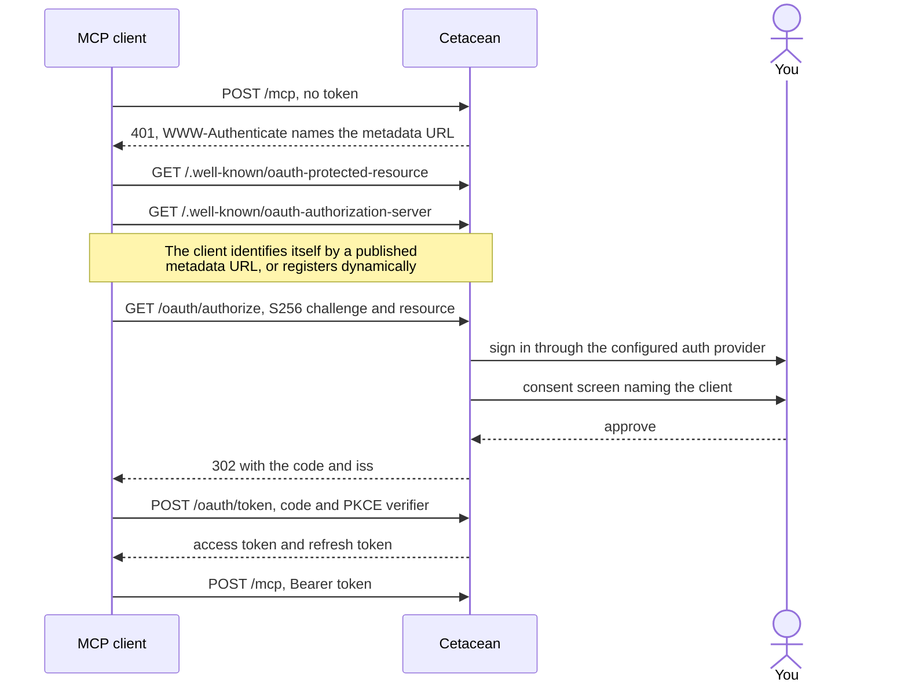

# MCP Server

Cetacean can expose your cluster to AI agents over the [Model Context Protocol](https://modelcontextprotocol.io/).
An agent reads the same live state the [dashboard][dashboard] shows and makes the same changes, under the same sign-in
and the same permissions as the people using the dashboard. For what an agent can actually see and do,
see [MCP tools and resources][mcp-tools].

## Turn it on

The server is off by default. Enable it with [`mcp.enabled`][mcp.enabled] on the Cetacean service in your
`compose.yaml`, then redeploy the stack:

```yaml
environment:
  CETACEAN_MCP: "true"
  CETACEAN_AUTH_MODE: oidc
  CETACEAN_PUBLIC_URL: https://cetacean.example.com
```

> [!WARNING]
> [`server.public_url`][server.public_url] is the URL clients reach from outside the cluster, not a service name
> on the overlay network. Getting it wrong breaks sign-in, and leaving it unset behind a proxy stops startup
> whenever MCP OAuth is in use.

Also set [`mcp.signing_key`][mcp.signing_key]. Without it Cetacean generates a new key on every restart, and every agent
has to sign in again after a redeployment. Generate one with `openssl rand -hex 32`.

## Connect a client

The endpoint is served at `{base_path}/mcp`. Point an MCP-capable client at it:

```jsonc
// Claude Code: .mcp.json
{
  "mcpServers": {
    "cetacean": {
      "type": "http",
      "url": "https://cetacean.example.com/mcp"
    }
  }
}
```

On first connect the client asks you to sign in through whichever auth provider you configured, then shows a
consent screen naming the client. Approve it and the agent is connected. There is no client secret to
generate and nothing to register by hand.

You are asked to approve a client once, not every session. Approval lasts [`mcp.consent_ttl`][mcp.consent_ttl] (90 days
by default) and renews each time you approve. Set it to `0s` to be asked every time. You are always asked again if the
client changes its name or redirect URLs.

## Decide what an agent may change

An agent is never more privileged than the identity that signed in. Two controls narrow it further.

[`mcp.operations_level`][mcp.operations_level] caps what agents may do, independently of the dashboard:

| Level | An agent may                                                           |
|-------|------------------------------------------------------------------------|
| `0`   | Read only                                                              |
| `1`   | Scale, restart, update images, roll back                               |
| `2`   | Also edit configuration: env vars, resources, placement, ports, labels |
| `3`   | Also remove services, tasks, configs, secrets, networks and volumes    |

It inherits [`server.operations_level`][server.operations_level] when unset. Setting it lower is how you let your team
scale services from the dashboard while agents stay read-only.

[Authorization][authorization] grants then apply per resource, exactly as they do for the dashboard. An agent holding
read-only grants is offered only the read tools; resources it may not read are reported as not found rather than as
forbidden, so the tool list never reveals what exists.

## Wait for changes to take effect

Docker accepts a change the moment you ask for it, which tells you nothing about whether it worked—the image may still
be pulling, or a placement constraint may be unsatisfiable. Scaling, restarting, image updates and rollbacks can
therefore wait for the cluster to settle before reporting back, so an agent says "done" when the replicas are actually
running.

Clients that support this opt in per call; the agent handles it, there is nothing to configure. A change that has not
settled within five minutes is reported as failed, and [`mcp.max_concurrent_tasks`][mcp.max_concurrent_tasks] (default
is 32) caps how many such waits run at once.

Four tools wait; the [API][api] offers the same wait on six endpoints, adding service mode and endpoint mode. That is
deliberate rather than an oversight: waiting over MCP costs a held task slot per call, so it is offered on the changes
an agent routinely makes and watches, while an HTTP client waits on its own connection and pays for nothing it is not
using.

## Trace agent activity

Point [`tracing.endpoint`][tracing.endpoint] at an OpenTelemetry collector that accepts OTLP over HTTP:

```yaml
environment:
  CETACEAN_OTEL_ENDPOINT: http://collector:4318
```

You get a span per agent request and a nested span per tool call, tagged with the tool name and an error status when it
fails—so you can see which agent scaled what, and when. If the calling agent is already tracing, its trace context is
picked up and Cetacean's spans join the same trace, putting the agent's turn and the Docker call it produced on
one timeline.


Tracing stays off until the endpoint is set. A malformed endpoint stops startup rather than silently exporting nowhere.

## Before you expose it

- **Run it behind TLS.** Cetacean warns at startup if MCP is enabled without TLS outside auth mode `none`.
- **Auth mode `none` leaves `/mcp` open.** Anyone who can reach it gets whatever the operations level allows.
  Use it only on a trusted network.
- **Set [`server.cors.origins`][server.cors.origins] if the consent screen crosses origins.** It also guards
  `/mcp` itself against DNS rebinding. Name the origins rather than using `*`: a browser-based client's every
  call is a `POST`, and a wildcard is not trusted for cross-origin writes, so those calls are refused.
  Non-browser clients send no `Origin` and are unaffected by either check.
- **Run a single replica.** Sign-in state lives in one process; see [How it works](#how-it-works).

## Troubleshooting

| Symptom                                          | Cause                                                                                                       |
|--------------------------------------------------|-------------------------------------------------------------------------------------------------------------|
| Client reports `unsupported protocol version`    | The client is older than MCP revision `2026-07-28`. Upgrade it; older revisions are refused.                |
| Every agent must sign in again after a redeploy  | [`mcp.signing_key`][mcp.signing_key] is unset, so a new key was generated at startup.                       |
| Sign-in fails or redirects somewhere unreachable | [`server.public_url`][server.public_url] is not the URL clients reach from outside.                         |
| A revoked agent still works for a while          | Access tokens stay valid until they expire. Lower [`mcp.access_token_ttl`][mcp.access_token_ttl].           |
| An agent reports a change it made as gone        | Its result was discarded after [`mcp.task_ttl`][mcp.task_ttl]. The change itself still happened.            |
| `cert` auth mode: client cannot connect          | mTLS cannot drive a browser consent screen. Set [`mcp.oauth.auth_bypass`][mcp.oauth.auth_bypass] to `cert`. |

## Behind a reverse proxy

Clients discover how to sign in by fetching well-known documents from Cetacean, so the proxy has to pass these
through to `/mcp`'s host alongside the endpoint itself:

```
/.well-known/oauth-protected-resource
/.well-known/oauth-authorization-server
/.well-known/openid-configuration
/oauth/authorize   /oauth/token   /oauth/revoke   /oauth/register
```

## How it works

Cetacean is its own OAuth 2.1 authorization server for `/mcp`, implementing the MCP `2026-07-28` authorization profile.
A client discovers it, sends you through your configured auth provider, and exchanges the result for an access token and
a refresh token. Access tokens are scoped to this deployment, so one cannot be replayed against another Cetacean.

Access tokens follow the JWT profile in [RFC 9068](https://www.rfc-editor.org/rfc/rfc9068): the header carries
`typ: at+jwt`, and the token is refused unless it does, so an ID token cannot be presented where an access token
belongs. Refresh tokens are opaque and unaffected.



The consent screen labels how the client identified itself. **Verified via published metadata** means the client is
named by a URL Cetacean fetched and checked. **Self-reported identity** means the client named itself; those are never
remembered, so you approve them every time.

Refresh tokens and approvals are stored in `mcp-tokens.json` under [`storage.data_dir`][storage.data_dir], at mode
`0600`—anyone who can write that file can pre-approve a client. Nothing else survives a restart, which is why a single
replica is required: the file is node-local, and an unset signing key would leave each replica signing differently.

[api]: api
[authorization]: authorization
[dashboard]: dashboard
[mcp-tools]: mcp-tools
[mcp.access_token_ttl]: configuration#mcp.access_token_ttl
[mcp.consent_ttl]: configuration#mcp.consent_ttl
[mcp.enabled]: configuration#mcp.enabled
[mcp.max_concurrent_tasks]: configuration#mcp.max_concurrent_tasks
[mcp.oauth.auth_bypass]: configuration#mcp.oauth.auth_bypass
[mcp.operations_level]: configuration#mcp.operations_level
[mcp.signing_key]: configuration#mcp.signing_key
[mcp.task_ttl]: configuration#mcp.task_ttl
[server.cors.origins]: configuration#server.cors.origins
[server.operations_level]: configuration#server.operations_level
[server.public_url]: configuration#server.public_url
[storage.data_dir]: configuration#storage.data_dir
[tracing.endpoint]: configuration#tracing.endpoint
