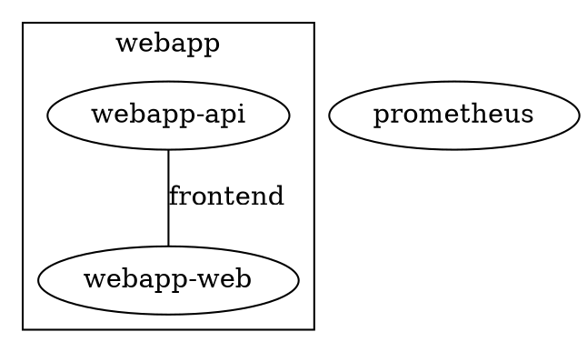

# Topology Export Formats Design (GraphML + DOT)

## Overview

Add GraphML and DOT (Graphviz) as content-negotiated export formats on `GET /topology`. Both serialize the network topology graph only (logical view). Pure serialization — no layout computation.

## Motivation

The JGF format serves the frontend and programmatic consumers. GraphML and DOT serve users who want to import the cluster topology into external tools (yEd, Gephi, Graphviz, Cytoscape) for analysis, documentation, or custom visualization.

## Content Negotiation

| Accept | Extension | Content-Type | Returns |
|--------|-----------|-------------|---------|
| `application/graphml+xml` | `.graphml` | `application/graphml+xml` | Network graph as GraphML XML |
| `text/vnd.graphviz` | `.dot` | `text/vnd.graphviz` | Network graph as DOT |

Existing formats unchanged: `application/vnd.jgf+json` (both graphs), `application/json` (both graphs), `text/html` (SPA).

## Architecture

Two new packages, each exposing a single `Render` function:

- `internal/api/graphml/graphml.go` — `Render(graph jgf.Graph) ([]byte, error)`
- `internal/api/dot/dot.go` — `Render(graph jgf.Graph) ([]byte, error)`

Both take a `jgf.Graph` (the network graph produced by `buildNetworkJGF`) and return serialized bytes. Pure functions with no HTTP or state dependencies.

The `/topology` route handler builds the network graph once, then dispatches to the appropriate renderer based on negotiated content type.

## GraphML Format

```xml
<?xml version="1.0" encoding="UTF-8"?>
<graphml xmlns="http://graphml.graphstudio.org">
  <key id="label" for="node" attr.name="label" attr.type="string"/>
  <key id="kind" for="node" attr.name="kind" attr.type="string"/>
  <key id="replicas" for="node" attr.name="replicas" attr.type="int"/>
  <key id="image" for="node" attr.name="image" attr.type="string"/>
  <key id="mode" for="node" attr.name="mode" attr.type="string"/>
  <key id="ports" for="node" attr.name="ports" attr.type="string"/>
  <key id="updateStatus" for="node" attr.name="updateStatus" attr.type="string"/>
  <key id="networks" for="edge" attr.name="networks" attr.type="string"/>
  <graph id="network" edgedefault="undirected">
    <graph id="stack:webapp" edgedefault="undirected">
      <data key="label">webapp</data>
      <node id="urn:cetacean:service:svc1">
        <data key="label">webapp-api</data>
        <data key="kind">service</data>
        <data key="replicas">3</data>
        <data key="image">api:latest</data>
        <data key="mode">replicated</data>
      </node>
      <node id="urn:cetacean:service:svc2">
        <data key="label">webapp-web</data>
        <data key="kind">service</data>
        <data key="replicas">2</data>
        <data key="image">web:latest</data>
        <data key="mode">replicated</data>
      </node>
    </graph>
    <node id="urn:cetacean:service:svc3">
      <data key="label">prometheus</data>
      <data key="kind">service</data>
      <data key="replicas">1</data>
      <data key="image">prom/prometheus:latest</data>
      <data key="mode">replicated</data>
    </node>
    <edge source="urn:cetacean:service:svc1" target="urn:cetacean:service:svc2">
      <data key="networks">frontend</data>
    </edge>
  </graph>
</graphml>
```

Key decisions:
- Node metadata fields become `<key>`/`<data>` pairs with typed attributes
- Stacks become nested `<graph>` elements (GraphML natively supports hierarchical grouping)
- `ports` serialized as comma-separated string (GraphML `<data>` is scalar)
- Network names on edges serialized as comma-separated string in the `networks` data key
- Node IDs are the full URNs
- Nodes declared inside their stack subgraph if they belong to one, at the top level if they don't

## DOT Format



Key decisions:
- Stacks become `subgraph cluster_<name>` (the `cluster_` prefix triggers Graphviz visual grouping)
- Services not in any stack are top-level nodes
- Node attributes from metadata (label, replicas, image, mode)
- Edge labels are comma-separated network names
- Quoted identifiers for URNs (contain colons)
- Undirected graph (`graph`, not `digraph`; `--` not `->`)

## Handler Changes

The `/topology` route's content type switch gains two new cases:

```go
case ContentTypeGraphML:
    // Build network graph, render as GraphML
case ContentTypeDOT:
    // Build network graph, render as DOT
```

Each case:
1. Calls `requireAnyGrant`
2. ACL-filters services
3. Calls `buildNetworkJGF` (existing function)
4. Calls the format-specific `Render(graph)`
5. Computes ETag from output bytes
6. Writes with appropriate `Content-Type`

Only the network graph is built — no placement graph, no wasted work.

## Negotiate Changes

Add to `negotiate.go`:
- `ContentTypeGraphML` and `ContentTypeDOT` constants
- `{"application", "graphml+xml", ContentTypeGraphML}` in supported types
- `{"text", "vnd.graphviz", ContentTypeDOT}` in supported types
- `.graphml` and `.dot` extension suffixes

## What Doesn't Change

- JGF output (both graphs)
- HTML/SPA behavior
- Deprecated endpoints
- Placement topology (not exported in these formats)
- ACL filtering (same as JGF path)
- Frontend code (no changes)
